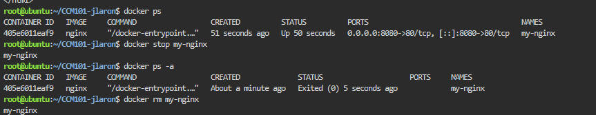

# Docker Deployment Log

## Docker Container Management

The following Docker commands were used to manage the Nginx container during the laboratory activity.

1. `docker ps` – Displays the containers that are currently running.

2. `docker stop my-nginx` – Stops the running Nginx container.

3. `docker ps -a` – Shows all containers, including containers that have already stopped. This was used to check the status of `my-nginx`.

4. `docker rm my-nginx` – Removes the stopped Nginx container from the system.

## Container Lifecycle

The activity demonstrated a basic Docker container lifecycle. The Nginx container was first checked while running, then stopped, inspected using `docker ps -a`, and finally removed using `docker rm`.

