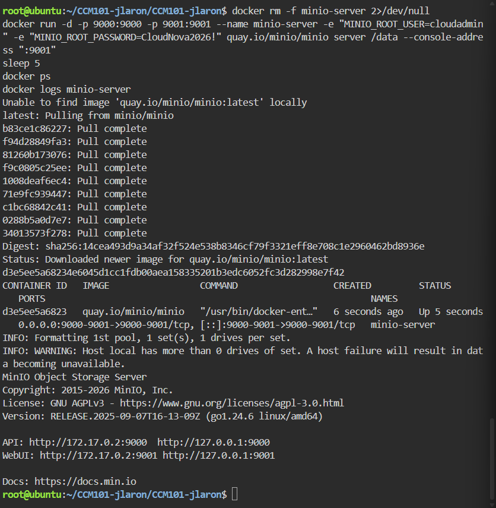
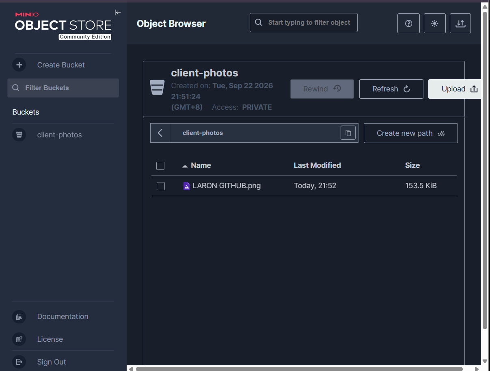

# MinIO Deployment Documentation

## Docker Command Used

```bash
docker run -d -p 9000:9000 -p 9001:9001 --name minio-server \
-e "MINIO_ROOT_USER=cloudadmin" \
-e "MINIO_ROOT_PASSWORD=CloudNova2026!" \
minio/minio server /data --console-address ":9001"
```

## Deployment Details

| Item | Value |
|---|---|
| Container name | `minio-server` |
| API port | 9000 |
| Web console port | **9001** |
| Bucket created | **`client-photos`** |

## Steps Taken

1. Launched a KillerCoda Ubuntu Playground.
2. Ran the `docker run` command above to pull and start MinIO.
3. Verified the container was running with `docker ps`.
4. Opened port 9001 through KillerCoda's Traffic / Ports menu to reach the MinIO Web Console.
5. Logged in with the credentials set in the Docker command.
6. Created the `client-photos` bucket and uploaded a test file.

## Explanation of the `-e` Flags (Environment Variables)

- `-e "MINIO_ROOT_USER=cloudadmin"` sets the admin username for logging in to the MinIO console and API.
- `-e "MINIO_ROOT_PASSWORD=CloudNova2026!"` sets the admin password for that account.

Environment variables let us configure the container at startup without changing the image or editing config files inside it. Note: these are lab-only credentials. In real deployments, secrets should never be committed to a repository.

## Other Flags

- `-d` runs the container in the background (detached).
- `-p 9000:9000` / `-p 9001:9001` map the API and console ports from the container to the host.
- `--name minio-server` gives the container a readable name.
- `server /data` starts MinIO and stores data in `/data`.
- `--console-address ":9001"` fixes the web console to port 9001.

## Evidence




